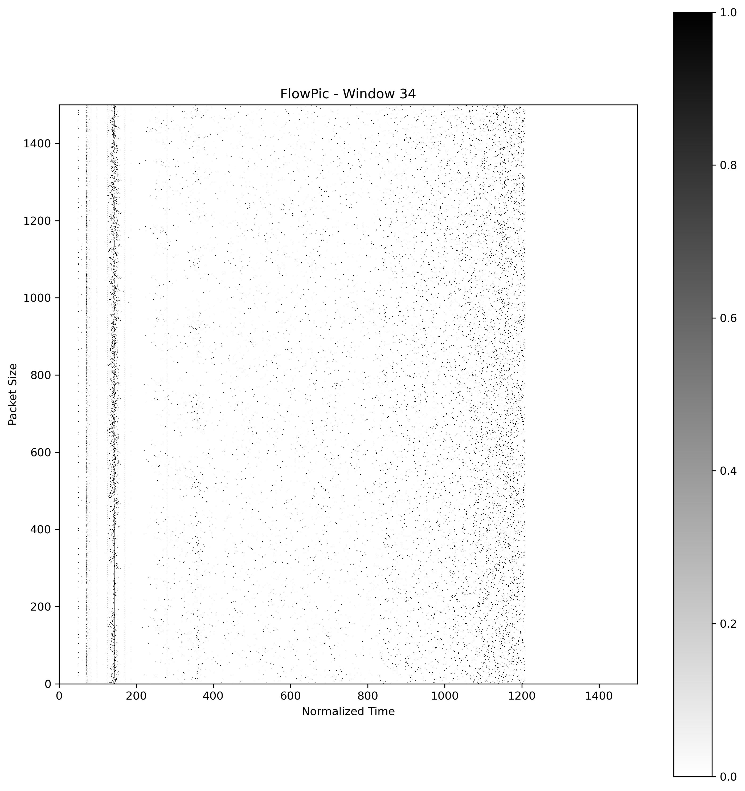
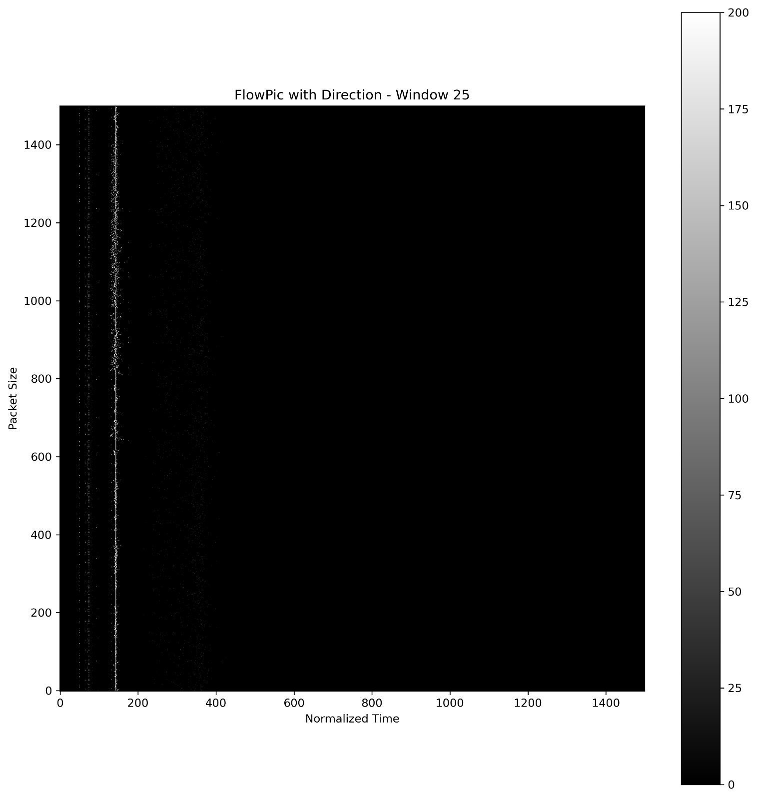

# Encrypted traffic classification imgaed based
This work is under the subject of encrypted traffic classification. There are a lot of reaserches and works under this subject. We are focusing on classification by representing the traffic as images.
## FlowPic representation Speed vs. Accuray
For doing the classification we are basing our work according to *Tal Shapira* and *Yuval Shavitt* work of traffic representation by images that called *FlowPic*.  
Here is example for *FlowPic* representation from our work:




Those 2 example of the first of <u>*video*</u> traffic, and the second of <u>*voip*</u> with direction feature.

You can read more on the *FlowPic* and *Tal Shapira* and *Yuval Shavitt* work on:
https://ieeexplore.ieee.org/document/9395707

**Article name:** "*FlowPic: A Generic Representation for Encrypted Traffic Classification and Applications Identification*"

### Our model
---
Our model is based on the model and work of the *FlowPic* we're trying to improve the accuracy and inference time.
We are using the ***CNN*** deeplearnig tool.
We are working on the known dataset ***VPN NON-VPN ISCX2016***

We have 4 attribuition types of traffic:  
1) Chat
2) file tranfser
3) voip
4) video

Those our 4 classes to classify.  

To see more how we created the data, divide it and make it into image format ,look down here on the 
[Preprocessing](#preprocessing)

To see our finding you can look on this presentation:  
[Open the PowerPoint presentation](FlowPic%20Speed%20vs%20Accuracy.pptx)  

Be aware that training time can take a while (around an hour), and need at least 16Gb of RAM.

## Experiments codes
To see our notebooke with all of our experiments that was mention in the presentation, we have here 3 folder:
1) **Other experiments**
2) **Direction_features**
3) **ML**

Most of our experiments are in `Other experiments` folder

## Our work in Kaggle
We worked on Kaggle website, where we could upload the datasets, and run on their services and use their CPU and GPU for running the models.  
For seeing the whole versions of the experiments and datasets look at our wrok on `kaggle` website:  
1. https://www.kaggle.com/code/shacharketz/cnn-dataset-pipeline
2. https://www.kaggle.com/code/chananhelman/flowpic-model

All preprocced datasets we've put there, so you can download them.


# Preprocessing

## Runing the model
One of our changes in the project it's to take it more generically that you can extract your dataset by yourself.

Now if you want to extract the data fron the `pcap` files by yourself run the `pcap_parser.py` here isan example how to run it:  
```bash
python .\pcap_parser --input "Input directory" --output "Out put directory"
```
This code will go all over pcap files in the input directory and will extract the data into `csv` files.  
**Note:** becuase we're using `scapy` library it can take time to extract the pcap files. we recommend this library because it more accurate int the extraction.

Thee feature that are extracted are:  
1. Timestamp
2. Source ip
3. Source port
4. Destination ip
5. Destination port
6. Protocol
7. Size

Most important featurs are `Timestamp` and `Size` beacuse the *FlowPic* is built according to them.

***
For adding more data for like **RelativeTime** For the *Machine learning*, and **Direction** for the *FlowPic feature adding*, run those 2 codes:
1. Relative_time.py (getting `--input "directory"`)
2. adding_direction.py (getting `--input "directory"`)

Then, for combining all the csv files into one csv file of the same class, and label them by name.
**Note:** Before running the code, change in *line 8* the name of the file according to the class (exmp. `csv_name = 'combined_file_dataset.csv`),
and in *line 28* the label name (exmp. `row.append('file')`)


```bash
python .\combine_csv --input "Input directory"
```
---
For the final step and creating the images in binary format, and spliting the data use the
`Datasetpreprocessing.ipynb` notebook (**Only till the part of saving the split *npy* files**).

There are taking the data from csv files and by `numpy` library we are representing our imagpes in <u>*npy*</u> files that from them can create the *FlowPic*, and labeling each npy class.  

Then we're creating `X, y` by concating all the classes into big *npy* dataset.  
After that we divide it to `train`, `test` and `validtion`, and saving them all separately.

**Note:** The data is very heavy, so before running ensure you have at least 16Gb of RAM. If not you can load the data in parts or run the code on platfrom that give this spcae like *Kaggle* or *Google Collab*.

***

### In conclusion:  
Form prepare data folder:  
1) pcap_parser.py
2) Relative_time.py
3) adding_direction.py
4) combine_csv.py

Form histogram:
* Datasetpreprocessing.ipynb (till the part of model creation)


For seeing the *FlowPic* in separate you can run the `functions_flowpic_hanan.py`:

```bash
python .\functions_flowpic_hanan.py --input "Input directory\combined_file.csv" --output "Out put directory"
```
It will create the *npy* files and the images (in *PNG*).  
 By defulat the window is of 60 second for each image, but you can change the window size and run again.
